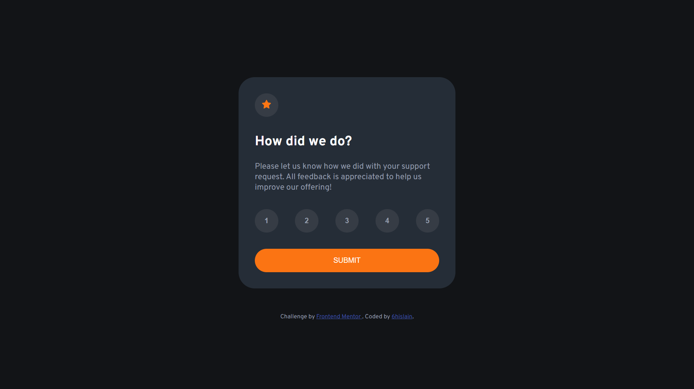

# Frontend Mentor - Interactive rating component solution

This is a solution to the [Interactive rating component challenge on Frontend Mentor](https://www.frontendmentor.io/challenges/interactive-rating-component-koxpeBUmI). Frontend Mentor challenges help you improve your coding skills by building realistic projects.

## Table of contents

- [Overview](#overview)
  - [The challenge](#the-challenge)
  - [Screenshot](#screenshot)
  - [Links](#links)
- [My process](#my-process)
  - [Built with](#built-with)
  - [What I learned](#what-i-learned)
  - [Continued development](#continued-development)
  - [Useful resources](#useful-resources)
- [Author](#author)
- [Acknowledgments](#acknowledgments)

## Overview

### The challenge

Users should be able to:

- View the optimal layout for the app depending on their device's screen size
- See hover states for all interactive elements on the page
- Select and submit a number rating
- See the "Thank you" card state after submitting a rating

### Screenshot



### Links

- Solution URL: [github.com/6hislain/interactive-rating-component](https://github.com/6hislain/interactive-rating-component)
- Live Site URL: [demo on netlify](https://62d45b1b43a4520efd973116--strong-meringue-17d64b.netlify.app/)

## My process

### Built with

- Semantic HTML5 markup
- CSS custom properties
- Flexbox
- [Vue.js](https://vuejs.org/) - The Progressive JavaScript Framework

### What I learned

I learnt to make an interactive button, I did not know about css transitions

```css
/* css/style.css line 64 */
.rate-button,
.star-button,
.rate-button-white {
  border-radius: 50%;
  min-width: 43px;
  font-weight: bold;
  background: hsl(216, 12%, 24%);
  transition-duration: 0.4s;
}
.rate-button:active,
.star-button:active,
.rate-button-white:active {
  transform: scale(0.8);
}
```

I also learnt to use Vue.js with the options API

```js
// index.html line 108
const { createApp } = Vue;
createApp({
  data() {
    return { isSubmitted: false, choice: 0 };
  },
  mounted() {
    document.getElementsByClassName("card")[0].style.display = "inherit";
  },
}).mount("#app");
```

### Continued development

I will continue learning Vue.js 3, especially the composition API

### Useful resources

- [CSS trick's guide to flexbox](https://css-tricks.com/snippets/css/a-guide-to-flexbox/) - This article helped me center the card and align the different buttons correctly
- [Vue.js official tutorial](https://vuejs.org/tutorial/#step-1) - This interactive tutorial helped me make the rating buttons and show the "thank you" message after submission

## Author

- Bio Link - [bio.link/6hislain](https://bio.link/6hislain)
- Frontend Mentor - [@6hislain](https://www.frontendmentor.io/profile/6hislain)
- Twitter - [@6hislain](https://www.twitter.com/6hislain)

## Acknowledgments

Thanks to [VueMastery](https://www.vuemastery.com/) and [VueSchool](https://vueschool.io/) for their free courses which introduced me to Vue.js
